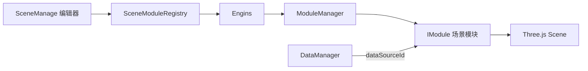

# Three.js 场景模块开发指南

本文面向在 `threejsCore/modules` 下开发场景模块的同事。

这里的“组件”指可在编辑器中新增、配置、绑定数据并由 Three.js 引擎管理生命周期的场景模块，例如：

- `Cube`
- `AxesHelper`
- `ExtrudeMap`

## 一、整体结构



各层职责：

- `SceneManage`：显示模块列表、属性表单和数据绑定入口。
- `SceneModuleRegistry`：连接编辑器与引擎，负责新增、删除、更新、保存和回显。
- `ModuleManager`：注册模块、排序并驱动生命周期。
- `IModule`：具体的 Three.js 场景能力。
- `DataManager`：管理静态数据和 API 数据，并通过 `dataSourceId` 通知模块。

## 二、模块目录约定

每个模块使用独立目录：

```text
modules/
├── Example/
│   ├── config.ts
│   ├── ExampleModule.ts
│   ├── styleSchema.ts
│   └── index.ts
├── config.ts
├── definitions.ts
├── styleSchema.ts
├── types.ts
└── syncObject3DProperties.ts
```

文件职责：

| 文件               | 职责                                         |
| ------------------ | -------------------------------------------- |
| `config.ts`        | 模块配置类型、解析后的配置类型、完整默认配置 |
| `ExampleModule.ts` | Three.js 对象创建、配置更新、动画和资源释放  |
| `styleSchema.ts`   | 编辑器属性面板的表单结构                     |
| `index.ts`         | 对外导出并声明 `moduleDefinition`            |

模块目录名称没有运行时意义，但建议使用与模块类一致的 PascalCase 名称。

## 三、模块接口

所有模块实现 `IModule<TConfig>`：

```ts
export interface IModule<TConfig = unknown> {
  id: string
  dataSourceId?: string
  name?: string
  order?: number
  config?: TConfig
  type?: ModulesType
  init?: (context: EngineContext) => void | Promise<void>
  start?: (context: EngineContext) => void | Promise<void>
  updateConfig?: (config: Partial<TConfig>, context: EngineContext) => void | Promise<void>
  onDataChange?: (data: unknown, context: EngineContext) => void | Promise<void>
  update?: (tick: TickInfo, context: EngineContext) => void
  resize?: (size: ResizeInfo, context: EngineContext) => void
  stop?: (context: EngineContext) => void | Promise<void>
  destroy?: (context: EngineContext) => void | Promise<void>
}
```

### 生命周期

| 方法           | 调用时机                         | 应做的事情                             |
| -------------- | -------------------------------- | -------------------------------------- |
| `constructor`  | 创建模块实例                     | 合并默认配置、生成 UUID，不操作场景    |
| `init`         | 注册模块时                       | 创建 Three.js 对象、加载资源并加入场景 |
| `start`        | 引擎启动或动态模块加入已启动引擎 | 恢复运行状态、播放入场动画             |
| `update`       | 每一帧                           | 更新 uniform、旋转、粒子或其他连续动画 |
| `updateConfig` | 编辑器属性变化                   | 更新配置，并决定局部更新还是重新构建   |
| `onDataChange` | 绑定的数据源变化                 | 校验数据并转换成模块配置或业务状态     |
| `resize`       | 画布尺寸变化                     | 更新与尺寸相关的资源                   |
| `stop`         | 引擎停止或删除模块前             | 停止运行并播放离场动画                 |
| `destroy`      | 删除模块或销毁引擎               | 移除对象、停止动画、释放全部资源       |

生命周期顺序通常为：

```text
constructor
  → init
  → start
  → update / updateConfig / onDataChange / resize
  → stop
  → destroy
```

## 四、创建一个模块

以下使用 `Example` 作为最小示例。

### 1. 定义配置

`modules/Example/config.ts`：

```ts
import type { ColorRepresentation, Vector3Tuple } from 'three'
import type { AnimationConfig, ModuleDefaultConfig } from '../config'

export interface ExampleEnterAnimationConfig extends AnimationConfig {
  startScale?: number
  startOpacity?: number
}

export interface ExampleLeaveAnimationConfig extends AnimationConfig {
  endScale?: number
  endOpacity?: number
}

export interface ExampleConfig
  extends ModuleDefaultConfig<ExampleEnterAnimationConfig, ExampleLeaveAnimationConfig> {
  size?: number
  color?: ColorRepresentation
  position?: Vector3Tuple
}

export type ResolvedExampleConfig = Required<
  Omit<ExampleConfig, 'id' | 'dataSourceId' | 'enterAnimation' | 'leaveAnimation'>
> & {
  enterAnimation: Required<ExampleEnterAnimationConfig>
  leaveAnimation: Required<ExampleLeaveAnimationConfig>
}

export const DEFAULT_EXAMPLE_CONFIG: ResolvedExampleConfig = {
  name: 'example',
  visible: true,
  renderOrder: 0,
  transitionDuration: 0.35,
  transitionEase: 'power2.out',
  size: 1,
  color: '#00aaff',
  position: [0, 0, 0],
  enterAnimation: {
    enabled: true,
    duration: 0.6,
    ease: 'power2.out',
    startScale: 0,
    startOpacity: 0
  },
  leaveAnimation: {
    enabled: true,
    duration: 0.4,
    ease: 'power2.in',
    endScale: 0,
    endOpacity: 0
  }
}
```

### 2. 配置设计要求

配置对象会被编辑器克隆、保存到浏览器并在刷新后回显，因此必须是可序列化数据。

推荐：

```ts
color: '#00aaff'
position: [0, 0, 0]
```

不要保存运行时对象：

```ts
color: new Color('#00aaff')
position: new Vector3(0, 0, 0)
texture: new Texture()
```

原因：

- `THREE.Color` 传给颜色表单会导致 `value.includes is not a function`。
- Three.js 实例经过 `structuredClone` 后不能保持原型。
- `Texture`、`Material`、`Geometry` 不适合保存到场景草稿。

运行时需要 Three.js 对象时再转换：

```ts
const color = new Color(this.config.color)
const position = new Vector3().fromArray(this.config.position)
```

其他要求：

- `id` 是模块实例标识，不放入解析后的业务配置。
- `dataSourceId` 是数据绑定关系，不作为渲染参数。
- `DEFAULT_*_CONFIG` 必须提供完整默认值。
- 数组和嵌套对象不能在不同模块实例之间共享可变引用。
- 配置字段使用 camelCase，并与 `styleSchema` 完全一致。

### 3. 编写属性面板

`modules/Example/styleSchema.ts`：

```ts
import type { ModuleStyleSchema } from '../types'
import { EASING_LABELS, EASING_OPTIONS } from '../styleSchema'
import { DEFAULT_EXAMPLE_CONFIG } from './config'

export const styleSchema = {
  type: 'object',
  properties: {
    name: {
      type: 'string',
      title: '名称',
      default: DEFAULT_EXAMPLE_CONFIG.name
    },
    visible: {
      type: 'boolean',
      title: '显示',
      default: DEFAULT_EXAMPLE_CONFIG.visible
    },
    size: {
      type: 'number',
      title: '尺寸',
      minimum: 0,
      default: DEFAULT_EXAMPLE_CONFIG.size
    },
    color: {
      type: 'string',
      format: 'color',
      title: '颜色',
      default: DEFAULT_EXAMPLE_CONFIG.color
    },
    position: {
      type: 'array',
      title: '位置',
      minItems: 3,
      maxItems: 3,
      default: [...DEFAULT_EXAMPLE_CONFIG.position],
      items: [
        { type: 'number', title: 'X' },
        { type: 'number', title: 'Y' },
        { type: 'number', title: 'Z' }
      ]
    },
    transitionEase: {
      type: 'string',
      title: '过渡缓动',
      enum: EASING_OPTIONS,
      enumNames: EASING_LABELS,
      default: DEFAULT_EXAMPLE_CONFIG.transitionEase
    }
  }
} satisfies ModuleStyleSchema

export default styleSchema
```

常用表单配置：

| 配置类型       | Schema                                  |
| -------------- | --------------------------------------- |
| 文本           | `{ type: 'string' }`                    |
| 数字           | `{ type: 'number', minimum, maximum }`  |
| 开关           | `{ type: 'boolean' }`                   |
| 颜色           | `{ type: 'string', format: 'color' }`   |
| 下拉框         | `{ type: 'string', enum, enumNames }`   |
| 二维或三维坐标 | `{ type: 'array', items: [...] }`       |
| 配置分组       | `{ type: 'object', properties: {...} }` |

默认数组和对象必须复制：

```ts
default: [...DEFAULT_EXAMPLE_CONFIG.position]
```

```ts
default: { ...DEFAULT_EXAMPLE_CONFIG.enterAnimation }
```

不要从 `../index` 导入模块公共常量：

```ts
// 错误：容易形成循环依赖
import { EASING_OPTIONS } from '../index'

// 正确：直接引用定义文件
import { EASING_OPTIONS } from '../styleSchema'
```

### 4. 实现模块类

`modules/Example/ExampleModule.ts`：

```ts
import { BoxGeometry, MathUtils, Mesh, MeshBasicMaterial } from 'three'
import { gsap } from 'gsap'
import { cloneDeep } from 'lodash'
import type { EngineContext, IModule, TickInfo } from '../../core'
import { DEFAULT_EXAMPLE_CONFIG } from './config'
import type { ExampleConfig, ResolvedExampleConfig } from './config'

export class ExampleModule implements IModule<ExampleConfig> {
  readonly id: string
  dataSourceId?: string
  readonly name: string
  readonly order = 0
  readonly type = 'BusinessView'
  readonly config: ResolvedExampleConfig

  private instance: Mesh<BoxGeometry, MeshBasicMaterial> | null = null
  private lifecycleAnimation: gsap.core.Timeline | null = null
  private running = false

  constructor(config: ExampleConfig = {}) {
    const { id, dataSourceId, enterAnimation, leaveAnimation, ...configOverrides } = config

    this.id = id ?? MathUtils.generateUUID()
    this.dataSourceId = dataSourceId
    this.config = {
      ...cloneDeep(DEFAULT_EXAMPLE_CONFIG),
      ...configOverrides,
      enterAnimation: {
        ...DEFAULT_EXAMPLE_CONFIG.enterAnimation,
        ...enterAnimation
      },
      leaveAnimation: {
        ...DEFAULT_EXAMPLE_CONFIG.leaveAnimation,
        ...leaveAnimation
      }
    }
    this.name = this.config.name
  }

  init(context: EngineContext): void {
    if (this.instance) return

    const geometry = new BoxGeometry(1, 1, 1)
    const material = new MeshBasicMaterial({
      color: this.config.color,
      transparent: true
    })
    const instance = new Mesh(geometry, material)

    instance.name = this.config.name
    instance.position.fromArray(this.config.position)
    instance.scale.setScalar(this.config.size)
    instance.visible = this.config.visible
    instance.renderOrder = this.config.renderOrder

    this.instance = instance
    context.scene.add(instance)
  }

  async start(): Promise<void> {
    this.running = true
    if (!this.instance) return

    this.instance.visible = this.config.visible
    if (!this.config.visible || !this.config.enterAnimation.enabled) return

    this.instance.scale.setScalar(this.config.enterAnimation.startScale)
    this.instance.material.opacity = this.config.enterAnimation.startOpacity

    await this.playAnimation(
      this.config.size,
      1,
      this.config.enterAnimation.duration,
      this.config.enterAnimation.ease
    )
  }

  update(tick: TickInfo): void {
    if (!this.running || !this.instance) return
    this.instance.rotation.y += tick.delta
  }

  updateConfig(config: Partial<ExampleConfig>): void {
    const {
      id: _id,
      dataSourceId: _dataSourceId,
      enterAnimation,
      leaveAnimation,
      ...configOverrides
    } = config

    Object.assign(this.config, configOverrides, {
      enterAnimation: {
        ...this.config.enterAnimation,
        ...enterAnimation
      },
      leaveAnimation: {
        ...this.config.leaveAnimation,
        ...leaveAnimation
      }
    })

    this.config.position = [
      this.config.position[0],
      this.config.position[1],
      this.config.position[2]
    ]

    if (!this.instance) return

    this.instance.name = this.config.name
    this.instance.visible = this.config.visible
    this.instance.renderOrder = this.config.renderOrder
    this.instance.position.fromArray(this.config.position)
    this.instance.scale.setScalar(this.config.size)
    this.instance.material.color.set(this.config.color)
  }

  onDataChange(data: unknown): void {
    if (!data || typeof data !== 'object' || Array.isArray(data)) return

    const source = data as Record<string, unknown>
    const config: Partial<ExampleConfig> = {}

    if (typeof source.visible === 'boolean') config.visible = source.visible
    if (typeof source.size === 'number' && Number.isFinite(source.size)) {
      config.size = source.size
    }
    if (typeof source.color === 'string') config.color = source.color

    this.updateConfig(config)
  }

  async stop(): Promise<void> {
    this.running = false
    if (!this.instance) return

    if (!this.config.leaveAnimation.enabled) {
      this.instance.visible = false
      return
    }

    await this.playAnimation(
      this.config.leaveAnimation.endScale,
      this.config.leaveAnimation.endOpacity,
      this.config.leaveAnimation.duration,
      this.config.leaveAnimation.ease
    )
    this.instance.visible = false
  }

  destroy(context: EngineContext): void {
    if (!this.instance) return

    this.lifecycleAnimation?.kill()
    context.scene.remove(this.instance)
    this.instance.geometry.dispose()
    this.instance.material.dispose()
    this.instance = null
  }

  private playAnimation(
    scale: number,
    opacity: number,
    duration: number,
    ease: string
  ): Promise<void> {
    if (!this.instance) return Promise.resolve()

    this.lifecycleAnimation?.kill()
    const instance = this.instance

    return new Promise((resolve) => {
      const finish = () => {
        if (this.lifecycleAnimation === timeline) {
          this.lifecycleAnimation = null
        }
        resolve()
      }

      const timeline = gsap.timeline({
        onComplete: finish,
        onInterrupt: finish
      })
      this.lifecycleAnimation = timeline

      timeline
        .to(instance.scale, { x: scale, y: scale, z: scale, duration, ease }, 0)
        .to(instance.material, { opacity, duration, ease }, 0)
    })
  }
}
```

模板只是最小结构。复杂模块应根据配置变化选择：

- 直接修改对象属性。
- 更新材质或 Shader uniform。
- 重新生成 Geometry。
- 重新请求资源并重建模块内容。

不要在每次表单变化时无条件销毁整个模块。

### 5. 声明模块定义

`modules/Example/index.ts`：

```ts
export * from './config'
export * from './ExampleModule'
export * from './styleSchema'

import { ExampleModule } from './ExampleModule'
import type { ExampleConfig } from './config'
import { styleSchema } from './styleSchema'
import type { SceneModuleDefinition } from '../types'

export const moduleDefinition: SceneModuleDefinition<ExampleConfig> = {
  type: 'Example',
  label: '示例组件',
  styleSchema,
  create: (config = {}) => new ExampleModule(config)
}
```

`definitions.ts` 使用：

```ts
import.meta.glob('./*/index.ts', { eager: true })
```

自动发现所有模块，因此不需要手动修改注册表。

模块没有出现在编辑器的“新增”列表时，依次检查：

1. 目录下是否存在 `index.ts`。
2. `index.ts` 是否导出 `moduleDefinition`。
3. `moduleDefinition.type` 是否唯一。
4. `styleSchema` 是否为对象。
5. `create` 是否返回有效的 `IModule`。

## 五、模块类型与注册类型

项目中存在两个不同的 `type`，不要混淆。

模块运行时类型：

```ts
readonly type = 'BusinessView'
```

它必须属于：

```ts
type ModulesType = 'BaseGround' | 'Light' | 'EffectAnim' | 'HelperTool' | 'BusinessView'
```

编辑器注册类型：

```ts
export const moduleDefinition = {
  type: 'Example'
}
```

注册类型用于编辑器新增、保存和恢复模块，应保持稳定且唯一。修改已经使用过的注册类型会导致旧场景草稿无法恢复对应模块。

## 六、公共配置

所有模块可以通过 `ModuleDefaultConfig` 获得以下字段：

```ts
interface ModuleDefaultConfig {
  id?: string
  dataSourceId?: string
  name?: string
  visible?: boolean
  renderOrder?: number
  transitionDuration?: number
  transitionEase?: string
  enterAnimation?: AnimationConfig
  leaveAnimation?: AnimationConfig
}
```

`name`、`visible`、`renderOrder` 对应 `Object3D` 的公共属性，可以使用：

```ts
syncObject3DProperties(instance, config)
```

它只负责同步 Three.js 对象属性，不负责创建对象、配置合并或生命周期。

## 七、配置更新策略

将配置分为三类：

### 1. 直接属性

例如：

- `name`
- `visible`
- `renderOrder`
- `position`
- `rotation`

直接更新实例即可。

### 2. 材质属性

例如：

- 颜色
- 透明度
- Shader uniform
- 贴图重复参数

更新材质或 uniform，并在必要时设置：

```ts
material.needsUpdate = true
```

### 3. 结构属性

例如：

- GeoJSON 地址
- 拉伸深度
- 粒子数量
- Geometry 分段数

这些配置通常需要重新构建局部内容。异步重建应使用版本号阻止旧请求覆盖新配置：

```ts
const version = ++this.buildVersion
const resource = await loadResource()

if (version !== this.buildVersion) {
  resource.dispose?.()
  return
}
```

## 八、异步资源

`ModuleManager.register()` 会触发 `init()`，但动态注册时不应假设外部一定等待异步初始化完成。

资源型模块建议保存构建 Promise：

```ts
private buildPromise: Promise<void> | null = null

init(context: EngineContext): void {
  this.createContainer(context)
  this.buildPromise = this.buildContent()
}

async start(): Promise<void> {
  await this.buildPromise
  await this.playEnterAnimation()
}
```

资源加载要求：

- 请求失败时输出包含资源地址的错误。
- 可选资源失败不应阻止主体模块显示。
- 新请求发起后，旧请求结果不能覆盖新配置。
- 模块销毁时使所有未完成的构建结果失效。
- 失效请求已经创建的纹理等资源仍需释放。

不要通过 `app.config.globalProperties` 在普通 TS 文件中读取资源根地址。应统一导出环境配置，或直接读取：

```ts
const imageBaseUrl = import.meta.env.VITE_IMAGE_URL
```

## 九、入场和离场动画

复杂模块建议使用一个 GSAP 时间轴表达分层顺序。

例如地图模块：

```text
侧面升起
  → 顶面显示
  → 边界显示
  → 标签依次显示
```

离场按相反顺序：

```text
标签隐藏
  → 边界隐藏
  → 顶面隐藏
  → 侧面下降
```

要求：

- 新动画开始前先停止旧时间轴。
- `stop()` 返回 Promise，让模块管理器等待离场结束。
- `destroy()` 必须再次停止未完成的动画。
- 时间轴中同时提供 `onComplete` 和 `onInterrupt`，保证 Promise 一定结束。
- 连续动画使用 `tick.delta`，不要写死每帧增加 `0.016`。

正确：

```ts
uniforms.time.value += tick.delta
```

不推荐：

```ts
uniforms.time.value += 0.016
```

## 十、数据绑定

模块实现 `onDataChange` 后，编辑器才会显示可用的数据绑定能力：

```ts
onDataChange(data: unknown): void {
  if (!data || typeof data !== 'object' || Array.isArray(data)) return

  const source = data as Record<string, unknown>
  const config: Partial<ExampleConfig> = {}

  if (typeof source.visible === 'boolean') {
    config.visible = source.visible
  }

  this.updateConfig(config)
}
```

数据关系：

```text
DataSource.id
  → Module.dataSourceId
  → ModuleManager 自动订阅
  → onDataChange(data)
```

要求：

- `dataSourceId` 使用数据源唯一 `id`。
- 不要在模块中自行订阅 `DataManager`。
- `onDataChange` 的参数是 `unknown`，必须校验后使用。
- 数据源删除后，Registry 会解除对应模块绑定。
- 一个数据源可以绑定多个模块。

## 十一、EngineContext

模块通过 `EngineContext` 获取引擎资源：

```ts
context.scene
context.camera
context.renderer
context.events
context.data
context.modules
```

常见用法：

```ts
init(context: EngineContext): void {
  context.scene.add(this.instance)
}

destroy(context: EngineContext): void {
  context.scene.remove(this.instance)
}
```

不要在模块内部创建新的 `Scene`、主相机或 `WebGLRenderer`。

### 事件发送与接收

`engine.events` 是提供给页面、低代码组件和第三方代码的公共事件入口，模块通过
`context.events` 使用同一个事件实例。因此第三方发送的事件可以被模块接收，模块发送的事件也可以被第三方接收。

先声明当前业务使用的事件和载荷：

```ts
interface MapSceneEvents {
  'map:region-click': {
    moduleId: string
    regionName: string
  }
  'map:focus-region': {
    regionName: string
  }
}
```

第三方不需要持有引擎实例，直接导入公共事件入口：

```ts
import { engineEvents } from '@/views/Projects/mapScene3D/threejsCore/core'

const events = engineEvents.withTypes<MapSceneEvents>()

const unsubscribe = events.on('map:region-click', ({ moduleId, regionName }) => {
  console.log(moduleId, regionName)
})

events.emit('map:focus-region', {
  regionName: '北京市'
})

unsubscribe()
```

`engineEvents`、`engine.events` 和 `context.events` 指向同一个实例。能够获取引擎实例的代码也可以继续使用：

```ts
const events = engine.events.withTypes<MapSceneEvents>()
```

模块使用相同的事件声明：

```ts
private unsubscribeFocusRegion: (() => void) | null = null

init(context: EngineContext): void {
  const events = context.events.withTypes<MapSceneEvents>()

  this.unsubscribeFocusRegion = events.on('map:focus-region', ({ regionName }) => {
    this.focusRegion(regionName)
  })
}

selectRegion(context: EngineContext, regionName: string): void {
  context.events.withTypes<MapSceneEvents>().emit('map:region-click', {
    moduleId: this.id,
    regionName
  })
}

destroy(): void {
  this.unsubscribeFocusRegion?.()
  this.unsubscribeFocusRegion = null
}
```

事件设计约定：

- 事件名称使用 `领域:动作`，例如 `map:region-click`、`chart:data-refresh`。
- 事件载荷使用对象，方便后续增加字段。
- `on()` 和 `once()` 都返回取消订阅函数，模块必须在 `destroy()` 中调用。
- 公共业务事件使用 `engine.events` 或 `context.events`。
- `context.eventsBus` 只驱动渲染循环和尺寸变化，不作为第三方事件入口。
- `withTypes()` 只增加 TypeScript 类型约束，不会创建新的事件总线。

## 十二、资源释放

`destroy()` 至少检查以下资源：

- `Geometry.dispose()`
- `Material.dispose()`
- `Texture.dispose()`
- `RenderTarget.dispose()`
- GSAP timeline 和 tween
- 事件监听
- 定时器和轮询
- DOM 标签
- 数据订阅
- 异步构建版本

共享材质可能被多个 Mesh 使用，批量释放时先放入 `Set<Material>`，避免重复处理。

销毁完成后清空实例引用：

```ts
this.instance = null
this.lifecycleAnimation = null
```

## 十三、导入规则

模块内部优先从定义文件直接导入：

```ts
import type { AnimationConfig, ModuleDefaultConfig } from '../config'
import { EASING_OPTIONS } from '../styleSchema'
import type { ModuleStyleSchema } from '../types'
```

避免模块内部从 `../index` 导入运行时值：

```ts
import { EASING_OPTIONS } from '../index'
```

因为 `modules/index.ts` 会再次导出各模块，容易形成：

```text
Module/styleSchema
  → modules/index
  → Module/index
  → Module/styleSchema
```

最终会出现：

```text
ReferenceError: Cannot access 'EASING_OPTIONS' before initialization
```

类型导入统一使用：

```ts
import type { ... } from '...'
```

## 十四、保存和回显

场景草稿会保存：

- 场景、相机和控制器配置
- 动态模块的 `id`、注册类型和配置
- 模块的 `dataSourceId`
- 静态数据源和 API 数据源

模块要支持正常回显，必须满足：

1. 构造函数允许传入已有 `id`。
2. 构造函数允许传入 `dataSourceId`。
3. 配置对象可以被 `structuredClone` 和 `JSON.stringify`。
4. `moduleDefinition.type` 保持不变。
5. 默认配置能够补全旧草稿缺少的新字段。

## 十五、提交前检查清单

### 配置

- [ ] 配置类型继承 `ModuleDefaultConfig`。
- [ ] 自定义动画类型继承 `AnimationConfig`。
- [ ] `ResolvedConfig` 排除了 `id` 和 `dataSourceId`。
- [ ] 默认配置完整且没有 Three.js 实例。
- [ ] 配置字段与 `styleSchema` 完全一致。

### 模块

- [ ] 使用 `THREE.MathUtils.generateUUID()` 生成新 ID。
- [ ] `init()` 不会重复创建实例。
- [ ] `start()` 和 `stop()` 能够重复执行。
- [ ] `update()` 使用 `tick.delta`。
- [ ] `updateConfig()` 区分直接更新和重新构建。
- [ ] `onDataChange()` 校验了 `unknown` 数据。
- [ ] 异步请求具有旧结果失效机制。
- [ ] `destroy()` 释放全部资源。

### 动画

- [ ] 入场和离场使用同一个受控时间轴引用。
- [ ] 新动画开始前停止旧动画。
- [ ] 时间轴中断后 Promise 仍会结束。
- [ ] 离场完成后对象不可见。

### 注册

- [ ] 目录下存在 `index.ts`。
- [ ] 导出了 `moduleDefinition`。
- [ ] 注册类型唯一且稳定。
- [ ] 没有从 `../index` 导入运行时公共值。

### 验证

- [ ] TypeScript 检查通过。
- [ ] Prettier 检查通过。
- [ ] 模块可以新增、删除和重新新增。
- [ ] 属性修改能够实时生效。
- [ ] 保存后刷新能够恢复。
- [ ] 数据源能够绑定、更新和解除绑定。
- [ ] 删除模块后场景中没有残留对象。
- [ ] 控制台没有 Shader、纹理或循环依赖错误。

## 十六、常见问题

### 模块未出现在新增列表

检查 `index.ts` 是否导出了合法的 `moduleDefinition`。

### 属性面板选中模块后报 `value.includes is not a function`

颜色字段传入了 `THREE.Color` 等对象。配置层应保存颜色字符串：

```ts
color: '#00aaff'
```

### 使用公共常量时报初始化错误

检查是否从 `modules/index.ts` 导入了运行时值。改为直接从定义文件导入。

### 数据绑定下拉框中没有模块

模块没有实现 `onDataChange()`，Registry 会将其视为不支持数据绑定。

### 修改 GeoJSON 地址后旧地图覆盖新地图

异步构建没有版本控制。为每次构建增加递增版本号，并在请求完成后检查版本。

### 删除模块后显存持续增长

检查 Geometry、Material、Texture、RenderTarget、GSAP 动画和 DOM 标签是否全部销毁。
