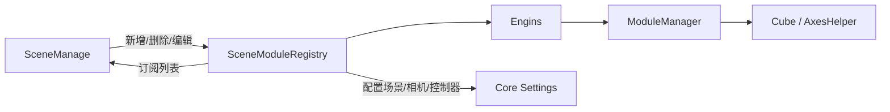

## SceneModuleRegistry的作用

```mermaid
flowchart LR
    UI["SceneManage"] -->|"新增/删除/编辑"| Registry["SceneModuleRegistry"]
    Registry --> Engine["Engins"]
    Engine --> Manager["ModuleManager"]
    Manager --> Module["Cube / AxesHelper"]
    Registry -->|"配置场景/相机/控制器"| Core["Core Settings"]
    Registry -->|"订阅列表"| UI
```

- 保存 Engine 引用。

- 保存动态创建的模块。

- 将模块转换成 SceneManage 可以使用的数据。

- 通知 SceneManage 列表发生变化。

- 转发新增、删除和配置更新命令。
